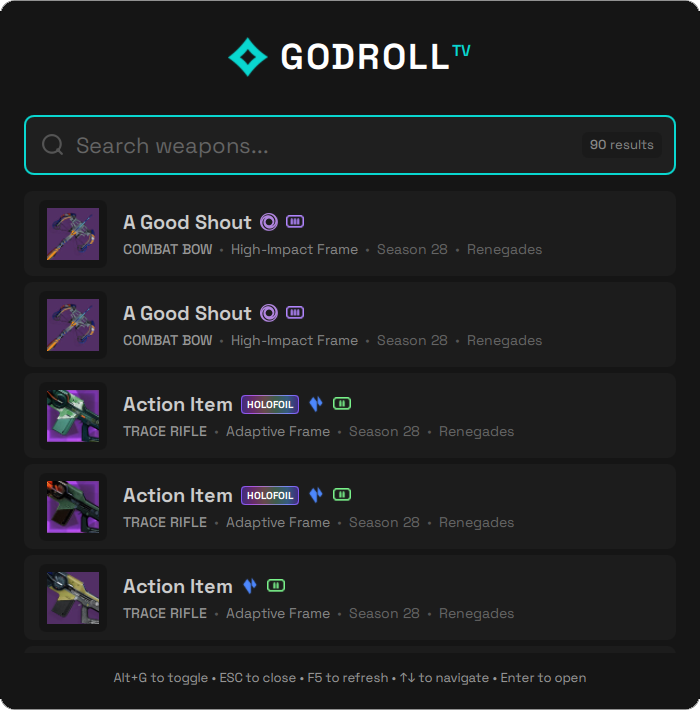

# Godroll.Bunker

A desktop launcher for quick Destiny 2 weapon search on [Godroll.tv](https://godroll.tv). Built with Qt 6 and QML.

Personal fork of [bugrakaan/godroll.tv-app](https://github.com/bugrakaan/godroll.tv-app), rebranded as Godroll.Bunker.


<div align="center">
  
  <p><em>App screenshot</em></p>
</div>

## Features

### Search
- Search by weapon name, weapon type, frame type, season, damage type, or ammo type
- Multi-term queries - Type "pulse high-impact void" to find High-Impact Void Pulse Rifles
- Fuzzy matching - Handles typos and partial matches
- Season search - Type "s28", "Season 28", or "Revenant" to filter by season

### Advanced Filters
- **`-h`** - Show only holofoil weapons (or use "holofoil"/"holo" keyword)
- **`-!`** - Show only one weapon per name (removes duplicates)
- **`-*`** - Remove 50-result limit, show all matches
- **`-a`** - Show only Adept/Harrowed/Timelost weapons (or use "adept" keyword)
- **`-e`** - Show only Exotic weapons (or use "exotic" keyword)
- **`-s <source>`** - Filter by source (raid, dungeon, activity, etc.)
- **`-t <perk>`** - Filter by perk/trait (e.g., `-t firefly`, `-t kc` for Kill Clip)
- **Damage Types** - Use `solar`, `arc`, `void`, `stasis`, `strand`, `kinetic` keywords
- **Ammo Types** - Use `primary`, `special`, `heavy` keywords
- **Combined** - Use together like `-!*h` or `-h -! -*`

### Perk Aliases
Common community shorthand is supported for trait search:
- `kc` → Kill Clip, `mkc` → Multikill Clip
- `ff` → Feeding Frenzy, `tt` → Triple Tap
- `ea` → Envious Arsenal, `recon` → Reconstruction
- `bns` → Bait and Switch, `demo` → Demolitionist

### Keyboard Shortcuts
- **`Alt + G`** - Toggle launcher (works globally)
- **`↑` / `↓`** - Navigate results
- **`Enter`** - Open selected weapon on godroll.tv
- **`Middle-click`** - Open weapon without closing launcher
- **`ESC`** - Close launcher or clear search
- **`F5`** - Reload weapon data
- **`F2`** - Toggle PvP Active Effects reference panel

### PvP Active Effects Reference
Press `F2` (or click the `FX` button) for a built-in reference of every exotic
armor effect that modifies weapon stats in PvP — handling, reload, stability,
range, airborne effectiveness, and damage multipliers. Includes entries missing
from godroll.tv's own Active Effects panel (tagged `ADDED`), such as
St0mp-EE5's −50 AE penalty and Sanguine Alchemy's 4.5% PvP damage boost.
Type in the search box to filter the list.

### Interface
- Weapon icons with damage type and ammo indicators
- Animated holofoil badge for holofoil weapons
- Season information with expansion names
- Active filter badges (source filters, trait filters)
- System tray integration
- Auto-start with Windows option

### Auto-Updater
- Automatic update check on startup and every 4 hours
- "Update Available" hint in search window (click to open dialog)
- Manual "Check for Updates" from tray menu
- One-click download and install
- Automatic ZIP extraction and file replacement

## Installation

### Download Release
1. Go to [Releases](../../releases)
2. Download the latest `GodrollBunker-vX.X.X.zip`
3. Extract to your preferred location
4. Run `GodrollBunker.exe`
5. (Optional) Right-click system tray icon to enable "Start with Windows"

### Build from Source

Requirements: Qt 6.10+ with MinGW, CMake 3.16+

```bash
mkdir build
cd build
cmake -G "MinGW Makefiles" -DCMAKE_PREFIX_PATH=C:/Qt/6.10.1/mingw_64 ..
cmake --build . --config Release
./GodrollBunker.exe
```

## Usage

### Search Examples

**Basic Search**
```
ace                    → Ace of Spades
pulse                 → All Pulse Rifles
aggressive            → All Aggressive Frame weapons
void                  → All Void damage weapons
```

**Multi-Term Search**
```
pulse high-impact     → High-Impact Pulse Rifles
void sword            → Void damage Swords
hand cannon solar     → Solar Hand Cannons
```

**Season Search**
```
s28                   → Season 28 weapons
season 28             → Season 28 weapons
revenant              → Season of the Revenant weapons
```

**Advanced Filters**
```
-h                    → Holofoil weapons only
-h pulse              → Holofoil Pulse Rifles
-! s28                → Unique weapons from Season 28
-* pulse              → All Pulse Rifles (no limit)
-a                    → All Adept/Harrowed/Timelost weapons
-e                    → All Exotic weapons
-!*h                  → All unique holofoil weapons
exotic hand cannon    → Exotic Hand Cannons
```

**Source Filter**
```
-s se                 → Salvation's Edge weapons
-s vog                → Vault of Glass weapons
-s gambit             → Gambit weapons
-s trials             → Trials of Osiris weapons
-s nightfall          → Nightfall weapons
-s iron               → Iron Banner weapons
-s duality            → Duality dungeon weapons
-s crotas             → Crota's End weapons
```

**Perk/Trait Filter**
```
-t firefly            → Weapons with Firefly perk
-t kc                 → Weapons with Kill Clip (alias)
-t recon ea           → Weapons with Reconstruction AND Envious Arsenal
void shotgun -t one   → Void Shotguns with One for All
-t destab -e          → Exotic weapons with Destabilizing Rounds
```

**Damage & Ammo Type Filter**
```
solar sniper          → Solar Snipers
void heavy            → Void Heavy weapons
strand primary        → Strand Primary weapons
arc special           → Arc Special weapons
```

### System Tray
- Left-click to show/hide launcher
- Right-click for options menu (auto-start, exit)

## Troubleshooting

**Launcher won't start**
- Check if another instance is already running (check system tray)
- Run from command line to see error messages

**Global hotkey not working**
- Check if another application is using `Alt+G`
- Restart the launcher after closing conflicting applications

**Weapons not loading**
- Check internet connection
- Press `F5` to reload

## Links

- Godroll.tv: https://godroll.tv
- Repository: https://github.com/r3bunker/Godroll.Bunker
- Upstream project: https://github.com/bugrakaan/godroll.tv-app

## License

MIT License

---

Original project created with ♥ by [Diabolic#5311](https://www.bungie.net/7/en/User/Profile/3/4611686018520824383)

